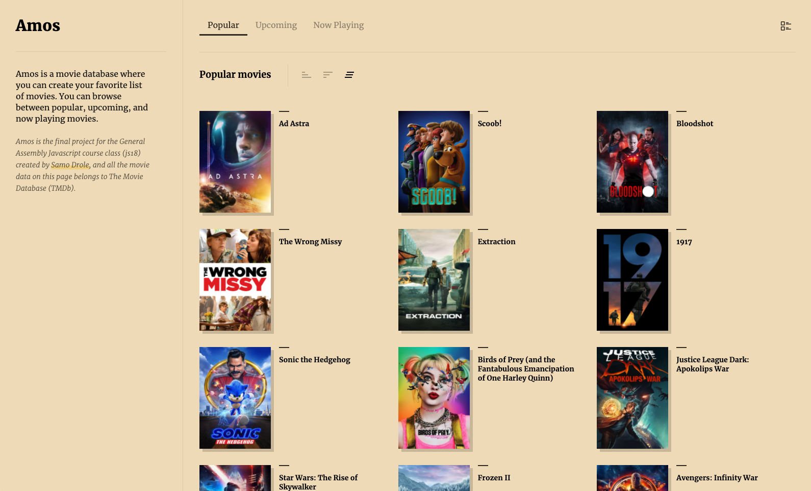
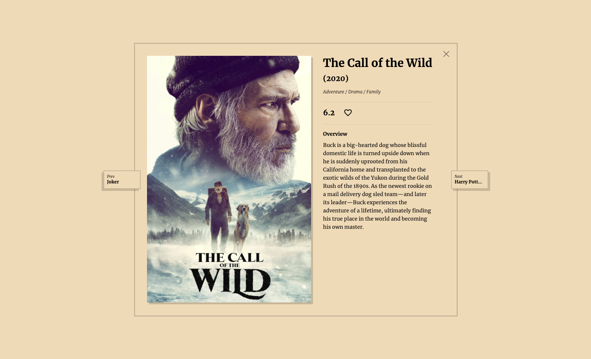
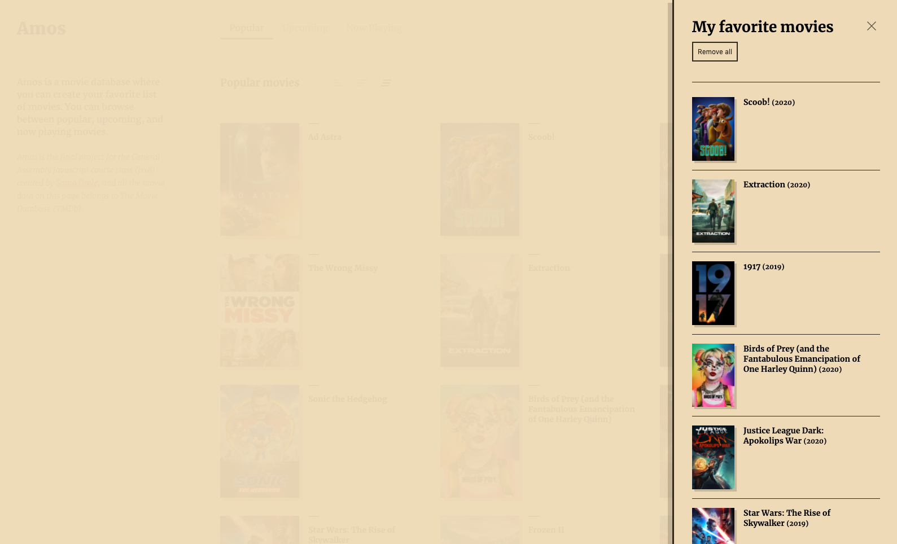

# Amos
**Your movie database**

---

Amos is a database with functional UI where users can search among Popular, Upcomiing, and New Playing movies. Using The Movie Database (TMDb) API to fetch the actual data and users can sort and save to favorite.

---

---

### Technology

This project is built with:
- Vanilla JS
- HTML
- CSS

I am using npm for Parcel web application bundler.

[Datasource for this project](https://developers.themoviedb.org/3/getting-started/introduction)
